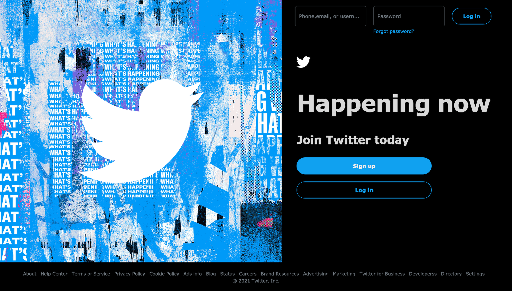
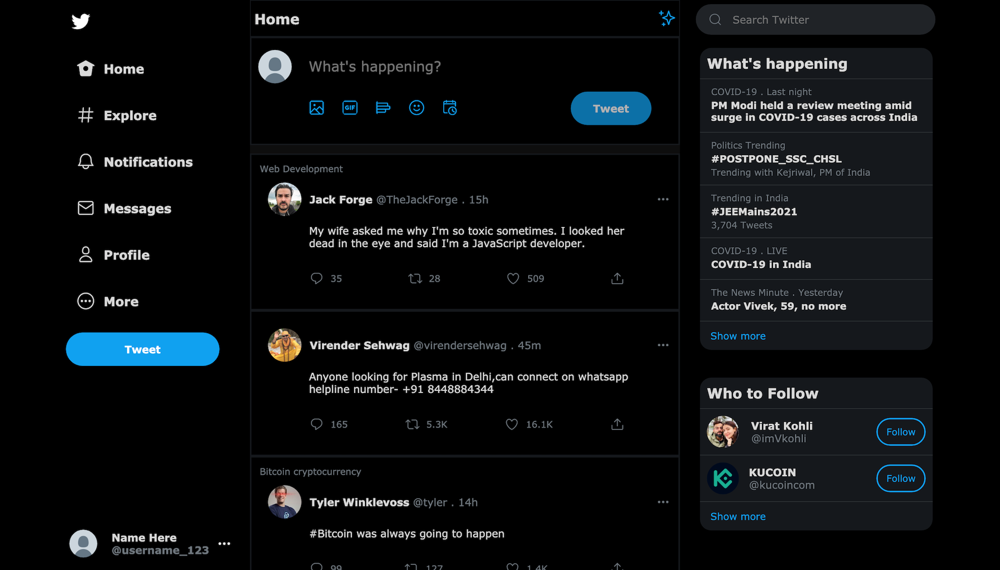

# This is a Twitter frontend clone made in react

##### This is only compatible in desktop mode

## To see the LogIn page edit the "import Dashboard from './main';" line number 3 in index.js file to "import Dashboard from './logIn';"

## To see the LogIn page edit the "import Dashboard from './logIn';" line number 3 in index.js file to "import Dashboard from './main';"

